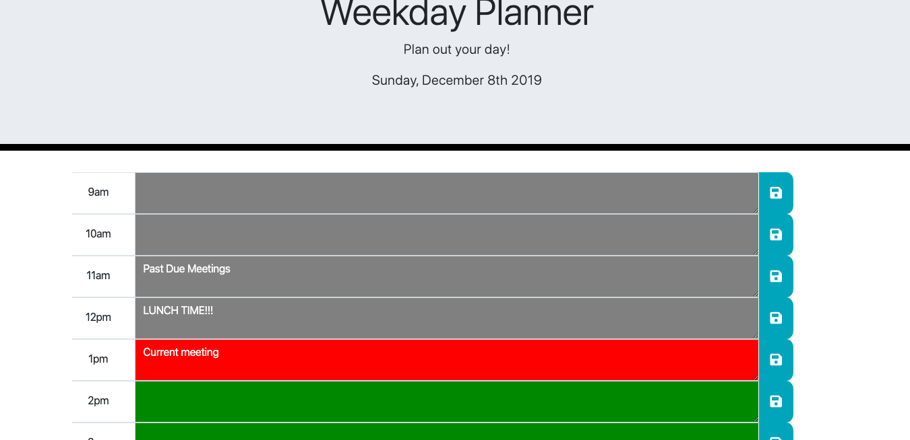

# Dayplanner

## Summary 
This is a workday planner. You can store and save your daily schedule. This webite utilizes JQUERY and Moment javascript libraries. The colors indicate current, past, and future times based on your local computers time. 

## Link to site
https://github.com/ken-Bains/dayplanner

## Site Picture



## Technologies Used
- HTML - used to create elements on the DOM
- CSS - styles html elements on page
- Git - version control system to track changes to source code
- GitHub - hosts repository that can be deployed to GitHub Pages
- Bootstrap - front-end framework used to create modern websites and web apps.
- Jquery - jQuery is a JavaScript library designed to simplify building websites.
- Moment.js - Framework used to maniplate local geological calender days and time zones.

## Code Snippet
```javascript
    function loadDayplannerValues() {
        var storage = JSON.parse(localStorage.getItem("dayplannerItems"));
        for (var i = 0; i < timeArr.length; i++){
            var num = i + 9;
            if(storage.hasOwnProperty(num)){
                var idOfTextArea = "#" + num;
                $(idOfTextArea).val(storage[num])
            }
        }
    };

```
- The code snippit above shows how the dayplanners information is stored to the page using your computers local storage. 


## Author Links
[LinkedIn](https://www.linkedin.com/in/ken-bains)
[GitHub](https://github.com/ken-Bains)
